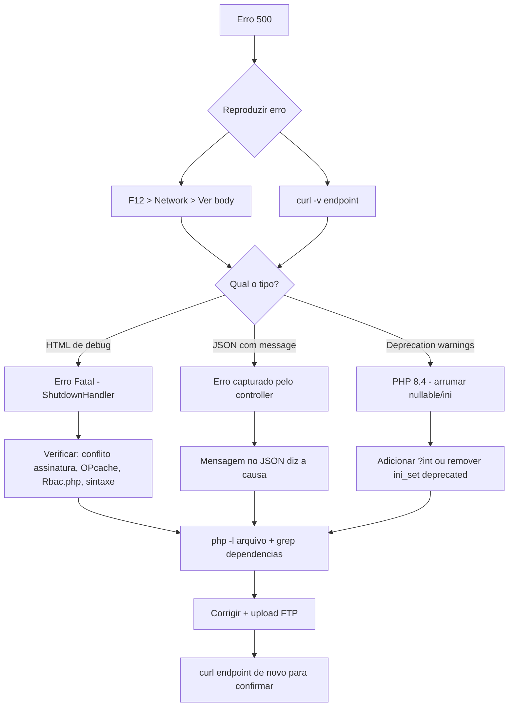

# Learning Guide do Sistema SisLoc

> **Documento Obrigatorio** — Todo codigo gerado para o SisLoc DEVE seguir os padroes definidos aqui.
> Ultima atualizacao: 2026-04-24
> Versao: 1.0.0

---

## Modo de Operacao

**A partir deste momento, este guia e a regra obrigatoria para todo desenvolvimento no SisLoc.**

Antes de gerar qualquer codigo:
1. **Verifique** se esta seguindo o padrao definido neste guia
2. **Caso precise fugir** do padrao, explique o motivo explicitamente
3. **Sempre priorize** nesta ordem:
   1. Consistencia com o codigo existente
   2. Estabilidade do sistema
   3. Compatibilidade com o que ja existe

**NUNCA introduza novas arquiteturas sem necessidade justificada.**

---

## 1. Analise de Padroes Existentes

Esta secao documenta os padroes REAIS extraidos do codigo fonte atual do SisLoc. Nada aqui e hipotetico — tudo foi observado nos arquivos existentes.

### 1.1 Padroes PHP — Controllers

**Localizacao:** `src/Controllers/`

#### Estrutura Obrigatoria

```php
<?php
namespace App\Controllers;

use App\Core\Response;
use App\Service\NomeService;
use App\Auth\Rbac;

class NomeController extends Controller
{
    private NomeService $service;
    private string $baseUrl;

    public function __construct()
    {
        parent::__construct();
        $this->service = new NomeService();
        $this->baseUrl = \App\Core\Env::get('BASE_URL');
    }
}
```

#### Metodo `index()` — Listagem

```php
public function index(): Response
{
    // 1. Verificar permissao RBAC
    if (!Rbac::check('modulo.listar')) {
        return $this->redirect($this->baseUrl . '/dashboard');
    }

    // 2. Capturar parametros de busca e paginacao
    $page = (int) $this->get('page', 1);
    $search = $this->get('search', '');

    // 3. Buscar dados com paginacao
    $data = $this->service->search($search, $page, 15);

    // 4. Retornar view com dados
    return $this->view('modulo/index', [
        'title' => 'Modulo',
        'items' => $data['data'],
        'pagination' => $data['pagination'],
        'search' => $search,
    ]);
}
```

#### Metodo `store()` — Criar Registro

```php
public function store(): Response
{
    // 1. Verificar permissao
    if (!Rbac::check('modulo.criar')) {
        return $this->redirect($this->baseUrl . '/modulo');
    }

    // 2. Validar CSRF
    $csrfToken = $this->post('_csrf_token');
    if (!\App\Core\Csrf::validate($csrfToken)) {
        return $this->redirect($this->baseUrl . '/modulo/create');
    }

    // 3. Extrair dados do POST
    $data = [
        'campo1' => $this->post('campo1'),
        'campo2' => $this->post('campo2'),
        'campo3' => $this->post('campo3', 'valor_padrao'),
    ];

    // 4. Criar registro
    $id = $this->service->create($data);

    // 5. Redirecionar com sucesso
    return $this->redirect($this->baseUrl . '/modulo?success=created');
}
```

#### Metodo `update()` — Atualizar Registro

```php
public function update($id): Response
{
    if (!Rbac::check('modulo.editar')) {
        return $this->redirect($this->baseUrl . '/modulo');
    }

    $csrfToken = $this->post('_csrf_token');
    if (!\App\Core\Csrf::validate($csrfToken)) {
        return $this->redirect($this->baseUrl . '/modulo/edit/' . $id);
    }

    $data = [
        'campo1' => $this->post('campo1'),
        'campo2' => $this->post('campo2'),
    ];

    $this->service->update($id, $data);

    return $this->redirect($this->baseUrl . '/modulo?success=updated');
}
```

#### Metodo `delete()` — Excluir Registro (AJAX JSON)

```php
public function delete($id): Response
{
    if (!Rbac::check('modulo.excluir')) {
        return $this->json(['success' => false, 'message' => 'Acesso nao autorizado'], 403);
    }

    $csrfToken = $this->post('_csrf_token');
    if (!\App\Core\Csrf::validate($csrfToken)) {
        return $this->json(['error' => 'Token CSRF invalido'], 400);
    }

    $this->service->delete($id);

    return $this->json(['success' => true]);
}
```

#### Metodo `toggle()` — Alternar Status (AJAX JSON)

```php
public function toggle($id): Response
{
    if (!Rbac::check('modulo.editar')) {
        return $this->json(['success' => false, 'message' => 'Acesso nao autorizado'], 403);
    }

    $csrfToken = $this->post('_csrf_token');
    if (!\App\Core\Csrf::validate($csrfToken)) {
        return $this->json(['error' => 'Token CSRF invalido'], 400);
    }

    $newStatus = $this->service->toggleStatus($id);

    return $this->json(['success' => true, 'status' => $newStatus]);
}
```

#### Regras de Response

| Contexto | Formato | Exemplo |
|----------|---------|---------|
| Form submit (store/update) | `redirect()` com `?success=created` ou `?success=updated` | `$this->redirect($url . '?success=created')` |
| AJAX delete | `json(['success' => true])` — SEM mensagem | `$this->json(['success' => true])` |
| AJAX toggle | `json(['success' => true, 'status' => $new])` | `$this->json(['success' => true, 'status' => 1])` |
| CSRF error (form) | `redirect()` de volta ao form | `$this->redirect($formUrl)` |
| CSRF error (AJAX) | `json(['error' => 'Token CSRF invalido'])` | `$this->json(['error' => '...'], 400)` |

#### Extracao de Dados

```php
// GET params
$this->get('page', 1);           // Com valor padrao
$this->get('search', '');        // Com valor padrao vazio

// POST params
$this->post('campo');            // Required
$this->post('campo', 'padrao');  // Com fallback
```

### 1.2 Padroes PHP — Services

**Localizacao:** `src/Service/`

#### Estrutura Obrigatoria

```php
<?php
namespace App\Service;

use App\Repository\NomeRepository;

class NomeService extends BaseService
{
    private NomeRepository $repo;

    public function __construct()
    {
        $this->repo = new NomeRepository();
        parent::__construct($this->repo);
    }
}
```

#### Metodo `create()` — Fluxo Padrao

```php
public function create(array $data): int
{
    $this->validate($data);           // 1. Validar
    $data = $this->sanitizeData($data); // 2. Sanitizar
    return $this->repo->create($data);  // 3. Persistir
}
```

#### Metodo `update()` — Fluxo Padrao

```php
public function update(int $id, array $data): int
{
    $this->validate($data, $id);       // 1. Validar (com ID)
    $data = $this->sanitizeData($data); // 2. Sanitizar
    return $this->repo->update($id, $data); // 3. Persistir
}
```

#### Metodo `toggleStatus()` — Padrao Obrigatorio

```php
public function toggleStatus(int $id): int
{
    $entity = $this->findOrFail($id);
    $newStatus = $entity['status'] == 1 ? 0 : 1;
    $this->repo->update($id, ['status' => $newStatus]);
    return $newStatus;
}
```

#### Metodo `validate()` — Assinatura

```php
protected function validate(array $data, ?int $id = null): void
{
    // Validacoes obrigatorias do BaseService
    $this->validateRequired($data, ['campo1', 'campo2']);

    // Validacoes customizadas
    if ($id === null && empty($data['campo_unico'])) {
        throw new \InvalidArgumentException('Campo obrigatorio para criacao');
    }
}
```

#### Metodo `sanitizeData()` — Limpeza

```php
protected function sanitizeData(array $data): array
{
    // APENAS limpar telefone com regex
    if (isset($data['telefone'])) {
        $data['telefone'] = preg_replace('/\D/', '', $data['telefone']);
    }

    // NAO fazer trim/strtolower — o BaseService ja faz
    return $data;
}
```

#### Flow de Execucao

```
create() / update()
    ↓
validate($data)
    ↓
    ├─ validateRequired()  (BaseService)
    ├─ validateEmail()     (BaseService, se aplicavel)
    └─ Custom rules        (Service especifico)
    ↓
sanitizeData($data)
    ↓
    ├─ preg_replace('/\D/', '', $telefone)  (Service)
    └─ trim(), strtolower()                 (BaseService)
    ↓
repo->create() / repo->update()  (Repository)
```

### 1.3 Padroes PHP — Repositories

**Localizacao:** `src/Repository/`

#### Estrutura Obrigatoria

```php
<?php
namespace App\Repository;

class NomeRepository extends BaseRepository
{
    protected string $table = 'nome_tabela';
    protected array $fillable = ['campo1', 'campo2', 'campo3', 'status'];
}
```

#### Declaracoes Obrigatorias

| Propriedade | Tipo | Exemplo | Uso |
|-------------|------|---------|-----|
| `$table` | `string` | `'clientes'` | Nome da tabela no banco |
| `$fillable` | `array` | `['nome', 'email', 'status']` | Colunas permitidas em create/update |

**REGRA CRITICA:** Se a tabela tem coluna `status TINYINT(1)`, voce DEVE incluir `'status'` no `$fillable`.

#### Metodos Herdados do BaseRepository

```php
// CRUD basico
create(array $data): int          // Retorna lastInsertId (int)
update(int $id, array $data): int // Retorna affected rows
delete(int $id): int              // Retorna affected rows
find(int $id): ?array             // Retorna registro ou null
all(): array                      // Retorna todos

// Busca com paginacao
search(string $search = '', int $page = 1, int $perPage = 15): array
// Retorna: ['data' => [...], 'pagination' => [...]]

// Metodo magico
__call(string $method, array $args)
// Permite: findByNome('valor'), findByStatus(1), etc.
```

#### Metodo `search()` — Quando Precisar de JOIN

```php
public function search(string $search = '', int $page = 1, int $perPage = 15): array
{
    $where = '';
    $params = [];

    if (!empty($search)) {
        $where = "WHERE n.nome LIKE :search OR n.email LIKE :search";
        $params[':search'] = "%{$search}%";
    }

    $offset = ($page - 1) * $perPage;

    // Count total
    $stmt = Connection::get()->prepare("
        SELECT COUNT(*) as total FROM nome_tabela n {$where}
    ");
    $stmt->execute($params);
    $total = $stmt->fetch(\PDO::FETCH_ASSOC)['total'];

    // Get page data
    $stmt = Connection::get()->prepare("
        SELECT n.*, c.nome as categoria_nome
        FROM nome_tabela n
        LEFT JOIN categorias c ON n.categoria_id = c.id
        {$where}
        ORDER BY n.id DESC
        LIMIT {$perPage} OFFSET {$offset}
    ");
    $stmt->execute($params);
    $data = $stmt->fetchAll(\PDO::FETCH_ASSOC);

    return [
        'data' => $data,
        'pagination' => [
            'total' => $total,
            'page' => $page,
            'perPage' => $perPage,
            'totalPages' => ceil($total / $perPage),
        ],
    ];
}
```

#### Acesso ao Banco de Dados

```php
// ERRADO — Nao usar $this->db
$stmt = $this->db->prepare(...);

// CERTO — Usar Connection estatico
use App\Database\Connection;

$stmt = Connection::get()->prepare(...);
$affected = Connection::exec('UPDATE ...', $params);
$lastId = (int) Connection::lastInsertId();
```

### 1.4 Padroes JavaScript

**Localizacao:** `public/js/`

#### Estrutura IIFE Obrigatoria

```javascript
/**
 * Nome do Modulo - Tab/Funcionalidade
 *
 * Variaveis globais disponiveis:
 * - window.CSRF_TOKEN: Token CSRF para requisicoes POST
 * - window.EVENTO_ID: ID do evento (se aplicavel)
 * - window.SALAS_MAP: Mapa de salas (se aplicavel)
 */
(function() {
  'use strict';

  // 1. Capturar variaveis globais
  var CSRF_TOKEN = window.CSRF_TOKEN;
  var EVENTO_ID = window.EVENTO_ID;

  // 2. Estado do modulo
  var state = {
    loading: false,
    data: [],
    editingId: null
  };

  // 3. Elementos DOM
  var elements = {
    form: document.getElementById('form-nome'),
    btnSalvar: document.getElementById('btn-salvar'),
    tabela: document.getElementById('tbl-nome')
  };

  // 4. Funcoes privadas
  function init() {
    bindEvents();
    loadData();
  }

  function bindEvents() {
    if (elements.form) {
      elements.form.addEventListener('submit', handleSubmit);
    }
    if (elements.btnSalvar) {
      elements.btnSalvar.addEventListener('click', handleSalvar);
    }
    // Event delegation para elementos dinamicos
    document.addEventListener('click', function(e) {
      var btn = e.target.closest('.btn-editar');
      if (btn) {
        handleEditar(btn);
      }
    });
  }

  function handleSubmit(e) {
    e.preventDefault();
    var formData = new FormData(elements.form);
    formData.append('_csrf_token', CSRF_TOKEN);

    fetch(window.BASE_URL + '/modulo/store', {
      method: 'POST',
      body: formData
    })
    .then(function(r) { return r.json(); })
    .then(function(data) {
      if (data.success) {
        showToast('green', 'Sucesso', 'Registro salvo com sucesso');
        setTimeout(function() { window.location.reload(); }, 1500);
      } else {
        showToast('red', 'Erro', data.message || 'Erro ao salvar');
      }
    })
    .catch(function() {
      showToast('red', 'Erro', 'Erro ao processar requisicao');
    });
  }

  // 5. Expor funcoes ao escopo global (quando necessario)
  window.editarRegistro = function(id) {
    // Implementacao
  };

  window.excluirRegistro = function(id) {
    if (confirm('Tem certeza que deseja excluir?')) {
      fetch(window.BASE_URL + '/modulo/delete/' + id, {
        method: 'POST',
        headers: {'Content-Type': 'application/x-www-form-urlencoded'},
        body: '_csrf_token=' + CSRF_TOKEN
      })
      .then(function(r) { return r.json(); })
      .then(function(data) {
        if (data.success) {
          showToast('green', 'Excluido', 'Registro excluido com sucesso');
          setTimeout(function() { window.location.reload(); }, 1500);
        } else {
          showToast('red', 'Erro', data.message || 'Erro ao excluir');
        }
      })
      .catch(function() {
        showToast('red', 'Erro', 'Erro ao processar requisicao');
      });
    }
  };

  // 6. Inicializacao
  if (document.readyState !== 'loading') { init(); }
  else { document.addEventListener('DOMContentLoaded', init); }
})();
```

#### Padroes de Fetch/AJAX

**POST com FormData (form submit):**
```javascript
var formData = new FormData(formElement);
formData.append('_csrf_token', CSRF_TOKEN);

fetch(BASE_URL + '/modulo/store', {
  method: 'POST',
  body: formData
});
```

**POST com URL-encoded (acoes simples):**
```javascript
fetch(BASE_URL + '/modulo/delete/' + id, {
  method: 'POST',
  headers: {'Content-Type': 'application/x-www-form-urlencoded'},
  body: '_csrf_token=' + CSRF_TOKEN
});
```

**GET com parametros:**
```javascript
var url = BASE_URL + '/modulo/api?search=' + encodeURIComponent(search) + '&page=' + page;

fetch(url)
  .then(function(r) { return r.json(); })
  .then(function(data) { /* ... */ });
```

#### Event Delegation

```javascript
// SEMPRE usar event delegation para elementos dinamicos
document.addEventListener('click', function(e) {
  // Botao editar
  var btnEdit = e.target.closest('.btn-editar');
  if (btnEdit) { handleEditar(btnEdit); }

  // Botao excluir
  var btnDel = e.target.closest('.btn-excluir');
  if (btnDel) { handleExcluir(btnDel); }

  // Botao toggle status
  var btnToggle = e.target.closest('.btn-toggle');
  if (btnToggle) { handleToggle(btnToggle); }
});
```

#### Debounce para Saves

```javascript
var debounceTimer;
function debouncedSave(callback, delay) {
  clearTimeout(debounceTimer);
  debounceTimer = setTimeout(callback, delay || 500);
}
```

### 1.5 Padroes de View (PHP Templates)

**Localizacao:** `views/`

#### Estrutura Obrigatoria

```php
<?php require dirname(__DIR__) . '/layout/header.php'; ?>

    <section class="section active" id="sec-modulo">
      <div class="section-header">
        <div class="section-icon">
          <svg><!-- icon SVG --></svg>
        </div>
        <div>
          <div class="section-title">Titulo do Modulo</div>
          <div class="section-sub">Descricao breve</div>
        </div>
      </div>
      <div class="divider"></div>

      <!-- CONTEUDO AQUI -->

    </section>

<?php require dirname(__DIR__) . '/layout/footer.php'; ?>
```

#### Import de Componentes

```php
<?php
// No inicio do arquivo, ANTES do conteudo, DEPOIS do header
require_once dirname(__DIR__, 2) . '/docs/layout/branco/assets/components/table/table.php';
require_once dirname(__DIR__, 2) . '/docs/layout/branco/assets/components/modal/modal.php';
require_once dirname(__DIR__, 2) . '/docs/layout/branco/assets/components/badge/badge.php';
require_once dirname(__DIR__, 2) . '/docs/layout/branco/assets/components/button/button.php';
require_once dirname(__DIR__, 2) . '/docs/layout/branco/assets/components/alert/alert.php';
require_once dirname(__DIR__, 2) . '/docs/layout/branco/assets/components/input/input.php';
require_once dirname(__DIR__, 2) . '/docs/layout/branco/assets/components/tabs/tabs.php';
?>
```

#### Padrao de Tabela com `renderTable()`

```php
<?php
// Gerar actionBtns ANTES do foreach (uma vez so)
$actionBtns = renderTableActions('default'); // ou 'crud'

$rows = [];
foreach ($items as $item) {
    $rows[] = [
        $item['id'], // ID como primeiro elemento
        ['html' => true, 'content' => htmlspecialchars($item['nome'])],
        ['html' => true, 'content' => $item['status']
            ? '<button type="button" class="btn btn-sm btn-green" onclick="toggleStatus(' . $item['id'] . ', this)">Ativo</button>'
            : '<button type="button" class="btn btn-sm btn-red" onclick="toggleStatus(' . $item['id'] . ', this)">Inativo</button>'
        ],
        ['html' => true, 'content' => date('d/m/Y H:i', strtotime($item['created_at']))],
        ['html' => true, 'content' => $actionBtns],
    ];
}

echo renderTable([
    'id' => 'tbl-modulo',
    'searchable' => true,
    'paginated' => true,
    'perPage' => 15,
    'headers' => [
        ['label' => 'ID', 'sortable' => true],
        ['label' => 'Nome', 'sortable' => true],
        ['label' => 'Status', 'sortable' => false],
        ['label' => 'Criado em', 'sortable' => true],
        ['label' => 'Acoes', 'sortable' => false],
    ],
    'rows' => $rows,
]);
?>
```

#### Handlers JavaScript para Tabela

```javascript
document.addEventListener('DOMContentLoaded', function() {
  var table = document.getElementById('tbl-modulo');
  if (!table) return;

  var rows = table.querySelectorAll('tbody tr');
  rows.forEach(function(row) {
    var id = row.querySelector('td:first-child')?.textContent?.trim();
    if (!id) return;

    // Handlers para botoes inline
    var buttons = row.querySelectorAll('.td-actions .btn-sm');
    buttons.forEach(function(btn) {
      var text = btn.textContent?.trim();
      if (text === 'Editar') {
        btn.setAttribute('onclick', 'editarModulo(' + id + ')');
        btn.style.cursor = 'pointer';
      } else if (text === 'Excluir') {
        btn.setAttribute('onclick', 'excluirModulo(' + id + ')');
        btn.style.cursor = 'pointer';
      }
    });

    // Handlers para dropdown
    var dropdown = row.querySelector('.td-act-dropdown');
    if (dropdown) {
      var dropBtns = dropdown.querySelectorAll('.td-act-item');
      dropBtns.forEach(function(btn) {
        var label = btn.querySelector('span')?.textContent?.trim() || btn.textContent?.trim();
        if (label === 'Editar') {
          btn.setAttribute('onclick', 'editarModulo(' + id + ')');
        } else if (label === 'Excluir') {
          btn.setAttribute('onclick', 'excluirModulo(' + id + ')');
        }
      });
    }
  });
});
```

#### Padrao de Formulario com `renderInput()`

```php
<form method="POST" action="<?= $baseUrl ?>/modulo/store">
  <input type="hidden" name="_csrf_token" value="<?= \App\Core\Csrf::getToken() ?>">

  <?= renderInput([
      'label' => 'Nome',
      'name' => 'nome',
      'type' => 'text',
      'required' => true,
      'placeholder' => 'Digite o nome'
  ]) ?>

  <div class="col2">
    <?= renderInput([
        'label' => 'Email',
        'name' => 'email',
        'type' => 'email',
        'required' => false,
    ]) ?>

    <?= renderInput([
        'label' => 'Telefone',
        'name' => 'telefone',
        'type' => 'tel',
        'placeholder' => '(00) 00000-0000',
    ]) ?>
  </div>

  <div style="margin-top:16px;display:flex;gap:8px">
    <a href="<?= $baseUrl ?>/modulo" class="btn btn-gray">Cancelar</a>
    <button type="submit" class="btn btn-cyan">Salvar</button>
  </div>
</form>
```

#### Padrao de Tabs com `renderTabsColor()`

```php
<?php
require_once dirname(__DIR__, 2) . '/docs/layout/branco/assets/components/tabs/tabs.php';

// Construir conteudo de cada tab em variaveis
$tab1Content = '<div class="fg">
  <div class="fl">Campo</div>
  <input class="fi" name="campo"/>
</div>';

$tab2Content = '<div class="card">
  <div class="card-body">Conteudo da tab 2</div>
</div>';

// Renderizar tabs
echo renderTabsColor([
    'id' => 'meu-tabs',
    'activeIndex' => 0,
    'tabs' => [
        ['label' => 'Dados', 'color' => 'cyan', 'content' => $tab1Content],
        ['label' => 'Config', 'color' => 'purple', 'content' => $tab2Content],
    ]
]);
?>
```

#### Padrao de Cards Estatisticos (KPIs)

```php
<div style="display:grid;grid-template-columns:repeat(4,1fr);gap:16px;margin-bottom:24px" class="modulo-stats-grid">
  <div class="card-stat">
    <div class="card-stat-val"><?= $total ?></div>
    <div class="card-stat-lbl">Total</div>
  </div>
  <div class="card-stat" style="--stat-color:var(--green)">
    <div class="card-stat-val" style="color:var(--green)"><?= $ativos ?></div>
    <div class="card-stat-lbl">Ativos</div>
  </div>
  <div class="card-stat" style="--stat-color:var(--yellow)">
    <div class="card-stat-val" style="color:var(--yellow)"><?= $pendentes ?></div>
    <div class="card-stat-lbl">Pendentes</div>
  </div>
  <div class="card-stat" style="--stat-color:var(--cyan)">
    <div class="card-stat-val" style="color:var(--cyan)"><?= $concluidos ?></div>
    <div class="card-stat-lbl">Concluidos</div>
  </div>
</div>

<style>
  @media (max-width:1024px){.modulo-stats-grid{grid-template-columns:repeat(2,1fr)!important}}
  @media (max-width:640px){.modulo-stats-grid{grid-template-columns:1fr!important}}
</style>
```

### 1.6 Padroes CSS

**Localizacao:** `public/css/styles.css`

#### Variaveis CSS Obrigatorias

```css
/* SEMPRE usar estas variaveis, nunca cores hardcoded */
--neon-cyan: #0B6E8C;
--neon-green: #059669;
--neon-red: #E11D48;
--neon-yellow: #F59E0B;
--neon-purple: #8B5CF6;
--neon-blue: #1D4ED8;
--neon-orange: #EA580C;
--neon-pink: #E11D48;
--neon-gray: #6B7280;

--bg-primary: #FFFFFF;
--bg-secondary: #F3F4F6;
--text-primary: #111827;
--text-secondary: #6B7280;
--text-muted: #9CA3AF;
```

#### Padrao de Formularios

```css
/* Estrutura: .fg > .fl + .fi */
.fg { margin-bottom: 16px; }
.fl { font-weight: 600; font-size: 12px; text-transform: uppercase; margin-bottom: 4px; }
.fi { width: 100%; padding: 8px 12px; border: 1px solid var(--border); border-radius: 6px; }
```

```html
<!-- Uso correto -->
<div class="fg">
  <div class="fl">Nome</div>
  <input class="fi" type="text" name="nome"/>
</div>

<!-- Grid 2 colunas -->
<div class="col2">
  <div class="fg">...</div>
  <div class="fg">...</div>
</div>
```

#### Padrao de Botoes

```css
/* Classe base */
.btn { padding: 8px 16px; border: none; border-radius: 6px; cursor: pointer; }

/* Variantes de cor */
.btn-cyan { background: var(--neon-cyan); color: white; }
.btn-green { background: var(--neon-green); color: white; }
.btn-red { background: var(--neon-red); color: white; }
.btn-gray { background: var(--neon-gray); color: white; }
.btn-purple { background: var(--neon-purple); color: white; }

/* Tamanho pequeno */
.btn-sm { padding: 4px 8px; font-size: 12px; }
```

#### Sistema de Grid

```css
.col2 { display: grid; grid-template-columns: 1fr 1fr; gap: 16px; }
.col3 { display: grid; grid-template-columns: 1fr 1fr 1fr; gap: 16px; }
.form-row-2 { /* 2 colunas em forms */ }
.form-row-3 { /* 3 colunas em forms */ }
.form-row-4 { /* 4 colunas em forms */ }
```

---

## 2. Regras do Sistema (Learning)

### 2.1 Regras de Arquitetura

| # | Regra | Justificativa |
|---|-------|---------------|
| 1 | **Sempre usar Repository-Service-Controller** | Separacao de responsabilidades |
| 2 | **Controller NUNCA faz SQL direto** | Todo acesso a DB passa por Service → Repository |
| 3 | **Service NUNCA retorna Response** | Apenas Controller retorna Response |
| 4 | **Repository NUNCA valida dados** | Validacao e responsabilidade do Service |
| 5 | **Service estende BaseService** | Herda sanitize(), findOrFail(), validateRequired() |
| 6 | **Repository estende BaseRepository** | Herda CRUD, paginate(), __call() |
| 7 | **Namespace sempre `App\`** | PSR-4 autoload |
| 8 | **Diretorio `src/Service/` (singular)** | NUNCA `src/Services/` (plural) |

### 2.2 Regras de Controllers

| # | Regra | Exemplo |
|---|-------|---------|
| 1 | **Sempre verificar RBAC antes de qualquer logica** | `if (!Rbac::check('modulo.listar'))` |
| 2 | **CSRF em todos os POST** | Forms e AJAX |
| 3 | **Forms usam `redirect()` com `?success=`** | `return $this->redirect($url . '?success=created')` |
| 4 | **AJAX usa `json()`** | `return $this->json(['success' => true])` |
| 5 | **Delete retorna `['success' => true]` SEM mensagem** | JS usa `showToast()` proprio |
| 6 | **CSRF error em AJAX retorna `['error' => '...']`** | Nao `['success' => false, 'message' => ...]` |
| 7 | **Usar `$this->post()` e `$this->get()`** | Nao `$_POST` ou `$_GET` direto |
| 8 | **`$baseUrl` vem de `Env::get('BASE_URL')`** | Nao hardcoded |

### 2.3 Regras de Services

| # | Regra | Exemplo |
|---|-------|---------|
| 1 | **Fluxo: validate → sanitize → persist** | Sempre nesta ordem |
| 2 | **`sanitizeData()` APENAS limpa telefone** | `preg_replace('/\D/', '', $telefone)` |
| 3 | **Nao fazer trim/strtolower** | BaseService ja faz |
| 4 | **`toggleStatus()` retorna `$newStatus`, NAO `repo->update()`** | `repo->update()` retorna affected rows (1), nao o valor do status |
| 5 | **`toggleStatus()` usa findOrFail + update** | Nao SQL direto |
| 6 | **`validate()` aceita `?int $id = null`** | Para diferenciar create de update |
| 7 | **Construtor cria repositorio e passa ao parent** | `parent::__construct($this->repo)` |

### 2.4 Regras de Repositories

| # | Regra | Exemplo |
|---|-------|---------|
| 1 | **Declarar `$table` e `$fillable`** | Obrigatorios |
| 2 | **`$fillable` inclui `status` se tabela tem** | Para toggle funcionar |
| 3 | **Usar `Connection::` estatico** | Nao `$this->db` |
| 4 | **`create()` retorna `int` (lastInsertId)** | Nao array ou bool |
| 5 | **`search()` retorna `['data' => [], 'pagination' => []]`** | Formato padrao |

### 2.5 Regras de JavaScript

| # | Regra | Exemplo |
|---|-------|---------|
| 1 | **Sempre usar IIFE** | `(function() { 'use strict'; ... })();` |
| 2 | **Capturar globais no topo do modulo** | `var CSRF_TOKEN = window.CSRF_TOKEN;` |
| 3 | **Event delegation para elementos dinamicos** | `document.addEventListener('click', function(e) { e.target.closest(...) })` |
| 4 | **Fetch com FormData para POST de forms** | `new FormData(form)` + append CSRF |
| 5 | **Fetch com URL-encoded para acoes simples** | `'_csrf_token=' + CSRF_TOKEN` |
| 6 | **Sempre usar `showToast()` para feedback** | Nao `alert()` |
| 7 | **Expor funcoes ao global via `window.`** | `window.editarRegistro = function(id) {...}` |
| 8 | **Inicializar com DOMContentLoaded check** | `if (document.readyState !== 'loading') { init(); }` |

### 2.6 Regras de Views

| # | Regra | Exemplo |
|---|-------|---------|
| 1 | **Sempre `header.php` + `footer.php`** | Nao escrever HTML completo |
| 2 | **Nao incluir topbar/sidebar separadamente** | Header ja inclui |
| 3 | **Usar `renderTable()` para listagens** | Nao HTML inline de tabela |
| 4 | **Usar `renderInput()` para campos** | Nao `<input class="fi">` inline |
| 5 | **Usar `renderTabsColor()` para tabs** | Nao HTML inline de tabs |
| 6 | **`htmlspecialchars()` em todos os outputs** | Proteger contra XSS |
| 7 | **CSRF hidden input em todos os forms** | `<input type="hidden" name="_csrf_token">` |
| 8 | **`actionBtns` gerado ANTES do foreach** | Uma vez so, nao em cada iteracao |
| 9 | **Botao cancelar usa `<a>` tag** | Nao `<button type="button" onclick="...">` |
| 10 | **Botao submit usa `<button>` direto** | Nao `renderButton()` para submit simples |

### 2.7 Regras de CSS

| # | Regra | Exemplo |
|---|-------|---------|
| 1 | **Nenhum CSS inline** (exceto display/margin) | Usar classes de `styles.css` |
| 2 | **Sempre usar variaveis CSS** | `var(--neon-cyan)`, nao `#0B6E8C` |
| 3 | **Forms usam `.fg > .fl + .fi`** | Padrao obrigatorio |
| 4 | **KPIs usam `card-stat`** | Nao `card` com texto centralizado |
| 5 | **Grids usam `.col2`, `.col3`** | Nao `col4` (nao existe) |

### 2.8 Regras de RBAC

| # | Regra | Exemplo |
|---|-------|---------|
| 1 | **Permissoes no array hardcoded em `Rbac.php`** | `'modulo.listar' => ['administrador', 'produtor']` |
| 2 | **Registrar modulo na tabela `modulos`** | Para interface /configuracoes |
| 3 | **Registrar permissoes na tabela `permissoes`** | 4 permissoes: listar, criar, editar, excluir |
| 4 | **Vincular em `role_permissoes`** | Para cada role que precisa acessar |
| 5 | **Verificar no controller com `Rbac::check()`** | Antes de qualquer logica |

---

## 3. Boas Praticas Ja Adotadas (Manter)

### 3.1 Arquitetura

- [x] **MVC com Repository-Service pattern** — Separacao clara de responsabilidades
- [x] **Singleton para Connection e Application** — Uma instancia global
- [x] **PSR-4 Autoload** — Namespaces organizados
- [x] **BaseService com metodos reutilizaveis** — `sanitize()`, `findOrFail()`, `validateRequired()`
- [x] **BaseRepository com CRUD generico** — `create()`, `update()`, `delete()`, `find()`
- [x] **Magic method `__call()` para findBy*** — `findByNome('valor')` funciona automaticamente

### 3.2 Seguranca

- [x] **CSRF token em todos os POST** — Forms e AJAX
- [x] **RBAC hard-coded + banco de dados** — Dupla camada de protecao
- [x] **`htmlspecialchars()` em outputs** — Protecao XSS
- [x] **Prepared statements PDO** — Protecao SQL injection
- [x] **Validacao no Service** — Antes de persistir

### 3.3 Frontend

- [x] **Design System 3.0 "White Rabbit"** — 21 temas, componentes reutilizaveis
- [x] **CSS variables para cores** — Facilita troca de tema
- [x] **IIFE para modulos JS** — Encapsulamento de escopo
- [x] **Event delegation** — Performance para elementos dinamicos
- [x] **`showToast()` para feedback** — UX consistente
- [x] **Tabelas com busca + paginacao + CRUD** — Padrao usuarios/clientes

### 3.4 DevEx

- [x] **Layout compartilhado** — `header.php`, `sidebar.php`, `footer.php`
- [x] **Componentes PHP reutilizaveis** — `renderTable()`, `renderInput()`, `renderModal()`
- [x] **Rotas por grupo** — `group('/modulo', ...)` com middleware
- [x] **Redirect com query de sucesso** — `?success=created`, `?success=updated`

---

## 4. Anti-Padroes Encontrados (NAO Replicar)

### 4.1 Inconsistencias de CSRF Token

**Problema:** O nome do campo CSRF varia entre `_csrf_token` e `csrf_token` em diferentes partes do codigo.

**OBSERVADO:**
- Forms usam `<input type="hidden" name="_csrf_token">` (com underscore)
- Alguns JS usam `CSRF_TOKEN` e enviam como `_csrf_token`
- Alguns controllers esperam `$this->post('csrf_token')` (sem underscore)

**REGRA:** **SEMPRE usar `_csrf_token`** (com underscore prefixado).

### 4.2 Inconsistencias de Response JSON

**Problema:** Algumas partes usam `success` como chave, outras usam `ok`.

**OBSERVADO:**
- Controllers de delete usam `['success' => true]`
- Bot WhatsApp usa `['ok' => true, 'data' => ...]`
- Alguns services usam `['success' => false, 'message' => ...]`

**REGRA:**
- **Controllers para AJAX:** usar `['success' => true/false]`
- **APIs externas (WhatsApp):** usar `['ok' => true/false, 'data' => ...]`

### 4.3 Inline Styles em Views

**Problema:** Existem ~132+ violacoes da regra "no inline CSS" nas views de evento.

**EXEMPLO RUIM:**
```php
<div style="display:flex;gap:8px;margin-top:16px">
```

**REGRA:** **NUNCA usar inline CSS** exceto para:
- `display:inline` ou `display:flex` simples
- `margin-top` para espacamento pontual
- Grid customizado para KPIs (com media queries)

### 4.4 Ordem de Componentes na View

**Problema:** Alguns arquivos incluem componentes (`require_once`) ANTES do `header.php`, outros DEPOIS.

**REGRA:** **Header PRIMEIRO**, depois imports de componentes:
```php
<?php require dirname(__DIR__) . '/layout/header.php'; ?>
<?php require_once '.../components/table.php'; ?>
```

### 4.5 Variaveis Nao Utilizadas

**Problema:** Controllers e Services declaram variaveis que nunca sao usadas.

**REGRA:** **Nunca declarar variaveis que nao sao usadas.** Se precisa de debug, usar `error_log()`.

### 4.6 SQL Direto no Controller

**Problema:** Alguns controllers fazem SQL direto ao inves de usar o Service.

**EXEMPLO RUIM:**
```php
// Controller
$stmt = Connection::get()->prepare("UPDATE modulo SET status = ? WHERE id = ?");
$stmt->execute([$newStatus, $id]);
```

**REGRA:** **Controller NUNCA faz SQL.** Usar `$this->service->toggleStatus($id)`.

### 4.7 `renderBadge()` para Status com Acao

**Problema:** Usar `renderBadge()` estatico para status que deveria ser toggleavel.

**EXEMPLO RUIM:**
```php
renderBadge(['label' => $item['status'] ? 'Ativo' : 'Inativo', 'variant' => 'green'])
```

**REGRA:** Se a tabela tem `status` e o modulo permite toggle, **usar botao clicavel**, nao badge estatico.

### 4.8 Handlers JS Genericos

**Problema:** Funcoes como `editItem()`, `deleteItem()` causam conflito entre modulos.

**REGRA:** **Sempre prefixar com nome do modulo:** `editCliente()`, `deleteFornecedor()`, `toggleEvento()`.

### 4.9 `col4` Nao Existe no CSS

**Problema:** Alguns devs usam `col4` (nao existe) para grids de 4 colunas.

**REGRA:** Para 4 colunas, usar **grid customizado com media queries**:
```html
<div style="display:grid;grid-template-columns:repeat(4,1fr);gap:16px">
```

### 4.10 CSRF Token com Rotacao Automatica

**Problema CRITICO:** `Csrf::validate()` rotacionava o token automaticamente apos cada validacao chamando `self::regenerate()`. Isso causava falha em requests AJAX porque:

1. Pagina carrega com token `A` (JS recebe via `<?= Csrf::getToken() ?>`)
2. Usuario clica em outro botao (ex: filtro) que faz POST e valida token `A`
3. `validate()` rotaciona para token `B`
4. Usuario clica no toggle de status — JS envia token `A` (antigo)
5. Servidor espera token `B` — **400 Token CSRF invalido**

**OBSERVADO:** Tokens diferentes entre JS e servidor session:
```
Recebido: 6256a132bb...
Session:  9c29fb61a2...
```

**REGRA:** **NUNCA rotacionar CSRF automaticamente no `validate()`.** A rotacao deve ser feita explicitamente apenas no login/logout. O metodo `Csrf::validate()` apenas compara o token recebido com o da session, sem modificar nada.

**CORRETO (Csrf.php):**
```php
public static function validate(string $token = null): bool
{
    if ($token === null) return false;
    $sessionToken = $_SESSION[self::$tokenKey] ?? null;
    if ($sessionToken === null || $token !== $sessionToken) return false;
    // NAO rotacionar aqui — apenas validar
    return true;
}
```

### 4.11 `toggleStatus()` Retorna Affected Rows ao Inves do Novo Status

**Problema CRITICO:** O metodo `toggleStatus()` nos Services retornava diretamente o resultado de `$this->repo->update()`, que retorna o **numero de linhas afetadas** (sempre 1), e nao o **valor do novo status** (0 ou 1).

**SINTOMA:** Botao de toggle so ativa (0→1) mas nao desativa (1→0). O JavaScript sempre recebe `status: 1` e mostra "Ativo" mesmo quando o banco foi atualizado para status 0.

**EXEMPLO RUIM (BUG em 8 Services corrigidos):**
```php
// ERRADO: retorna affected rows (1), nao o status real
public function toggleStatus(int $id): int
{
    $entity = $this->findOrFail($id);
    $newStatus = $entity['status'] == 1 ? 0 : 1;
    return $this->repo->update($id, ['status' => $newStatus]);  // <-- BUG!
}
```

**CORRETO:**
```php
public function toggleStatus(int $id): int
{
    $entity = $this->findOrFail($id);
    $newStatus = $entity['status'] == 1 ? 0 : 1;
    $this->repo->update($id, ['status' => $newStatus]);  // executa update
    return $newStatus;                                    // retorna o status real
}
```

**Services corrigidos:** Cliente, Categoria, Demandante, Sala, Produtor, CategoriaSala, ProdutoEvento, Subcategoria, Evento.

**Services que ja estavam corretos:** Fornecedor, User, Produto, Colaborador.

---

## 5. Guia de Continuidade

### 5.1 Como Criar um Novo Modulo

#### Checklist Completo (Ordem de Execucao)

1. **Banco de Dados**
   ```sql
   CREATE TABLE modulo (
       id INT AUTO_INCREMENT PRIMARY KEY,
       nome VARCHAR(255) NOT NULL,
       status TINYINT(1) DEFAULT 1,
       created_at TIMESTAMP DEFAULT CURRENT_TIMESTAMP
   );
   ```

2. **Repository** (`src/Repository/ModuloRepository.php`)
   ```php
   class ModuloRepository extends BaseRepository
   {
       protected string $table = 'modulo';
       protected array $fillable = ['nome', 'status'];
   }
   ```

3. **Service** (`src/Service/ModuloService.php`)
   ```php
   class ModuloService extends BaseService
   {
       private ModuloRepository $repo;
       public function __construct() {
           $this->repo = new ModuloRepository();
           parent::__construct($this->repo);
       }
   }
   ```

4. **Controller** (`src/Controllers/ModuloController.php`)
   - Implementar: `index`, `create`, `store`, `edit`, `update`, `delete`, `toggle`

5. **Views** (`views/modulo/index.php`, `create.php`, `edit.php`)
   - Usar componentes do Design System

6. **Rotas** (`public/index.php`)
   ```php
   $app->router()->group('/modulo', function($router) {
       $router->get('/', [ModuloController::class, 'index']);
       $router->get('/create', [ModuloController::class, 'create']);
       $router->post('/store', [ModuloController::class, 'store']);
       $router->get('/edit/{id}', [ModuloController::class, 'edit']);
       $router->post('/update/{id}', [ModuloController::class, 'update']);
       $router->post('/delete/{id}', [ModuloController::class, 'delete']);
       $router->post('/toggle/{id}', [ModuloController::class, 'toggle']);
   }, [\App\Http\Middleware\AuthMiddleware::class]);
   ```

7. **RBAC Array** (`src/Auth/Rbac.php`)
   ```php
   'modulo.listar' => ['administrador'],
   'modulo.criar' => ['administrador'],
   'modulo.editar' => ['administrador'],
   'modulo.excluir' => ['administrador'],
   ```

8. **RBAC Database**
   ```sql
   INSERT INTO modulos (nome, titulo, descricao, icone, ordem) VALUES (...);
   INSERT INTO permissoes (modulo_id, nome, titulo, descricao, role_required) VALUES (...);
   INSERT INTO role_permissoes (role, permissao_id) SELECT ...;
   ```

9. **Sidebar** (`views/layout/sidebar.php`)
   - Adicionar link com `Rbac::check('modulo.listar')`

10. **Analise de Codigo Morto**
    - Verificar metodos nao chamados, variaveis nao usadas, imports desnecessarios

### 5.2 Como Criar uma Nova Tela

1. **Definir se e listagem, formulario ou dashboard**
2. **Copiar estrutura de tela existente como base**
3. **Adaptar componentes para o novo contexto**
4. **Seguir padrao header.php → secao → footer.php**
5. **Usar `renderTable()`, `renderInput()`, `renderTabsColor()` conforme necessario**

### 5.3 Como Integrar JS + PHP

1. **PHP prepara dados e passa para view** (variaveis JS inline)
2. **JS captura globais no topo do modulo IIFE**
3. **JS faz fetch para endpoints PHP**
4. **PHP retorna JSON padronizado**
5. **JS usa `showToast()` para feedback**

```php
<!-- PHP na view -->
<script>
window.MODULO_ID = <?= $moduloId ?>;
window.MODULO_DATA = <?= json_encode($data) ?>;
</script>
<script src="<?= $baseUrl ?>/js/modulo/script.js"></script>
```

```javascript
// JS no modulo
(function() {
  'use strict';
  var MODULO_ID = window.MODULO_ID;
  var MODULO_DATA = window.MODULO_DATA;
  // ... usar variaveis
})();
```

### 5.4 Como Manter Padroes Visuais

1. **Sempre usar classes do Design System**
2. **Nunca criar componentes do zero**
3. **Verificar `registry.json` antes de criar novo componente**
4. **Usar variaveis CSS para cores**
5. **Seguir estrutura `.fg > .fl + .fi` para formularios**
6. **Usar `renderTable()` para todas as listagens**

---

## 6. Modo de Operacao Obrigatorio

### 6.1 Principios

Todo codigo gerado para o SisLoc DEVE:

1. **Seguir exatamente os padroes identificados neste guia**
2. **Manter compatibilidade com o sistema atual**
3. **Nao introduzir novas arquiteturas sem necessidade justificada**
4. **Priorizar consistencia sobre inovacao**
5. **Priorizar estabilidade sobre features novas**
6. **Priorizar compatibilidade com codigo existente**

### 6.2 Checklist Pre-Geracao

Antes de gerar qualquer codigo, verificar:

- [ ] Estou seguindo o padrao de Controller/Service/Repository deste guia?
- [ ] Estou usando os componentes corretos do Design System?
- [ ] Estou usando IIFE para JavaScript?
- [ ] Estou protegendo com CSRF e RBAC?
- [ ] Estou usando `showToast()` para feedback?
- [ ] Estou usando `htmlspecialchars()` para outputs?
- [ ] Estou seguindo a ordem header → conteudo → footer nas views?
- [ ] Estou usando `_csrf_token` (com underscore)?
- [ ] Estou evitando CSS inline desnecessario?
- [ ] Estou evitando anti-padroes listados na secao 4?

### 6.3 Quando Fugir do Padrao

Se precisar fugir de algum padrao:

1. **Documentar explicitamente o motivo**
2. **Explicar por que o padrao nao se aplica**
3. **Garantir que a alternativa e segura e consistente**
4. **Solicitar aprovacao do usuario antes de aplicar**

### 6.4 Referencias Rapidas

| Precisa | Onde Encontrar |
|---------|----------------|
| Padrao Controller | Secao 1.1 |
| Padrao Service | Secao 1.2 |
| Padrao Repository | Secao 1.3 |
| Padrao JavaScript | Secao 1.4 |
| Padrao View | Secao 1.5 |
| Padrao CSS | Secao 1.6 |
| Regras de Arquitetura | Secao 2.1 |
| Regras de Controllers | Secao 2.2 |
| Anti-padroes | Secao 4 |
| Checklist Novo Modulo | Secao 5.1 |

---

## 7. Padroes de Integracao WhatsApp

### 7.1 Configuracao do Bot

| Item | Valor |
|------|-------|
| URL Base | `http://201.23.68.17:3000` |
| API Key Header | `x-api-key` |
| API Key | `06892917bf7e13f46df9cb17cb0bd9211e40a2f437a65ff0f906e424c1d18a02` |
| Sessao Padrao | `sisloc` |

### 7.2 Endpoints Principais

| Metodo | Endpoint | Uso |
|--------|----------|-----|
| GET | `/health` | Health check (sem auth) |
| POST | `/sessions/:id/send-message` | Enviar mensagem de texto |
| POST | `/sessions/:id/send-media` | Enviar midia por URL |
| GET | `/sessions/:id/qr` | QR Code PNG |
| POST | `/sessions/:id/logout` | Logout + novo QR |

### 7.3 Formato de Mensagem

```json
{
  "number": "556182198228",
  "message": "Ola! Sua notificacao do sistema SisLoc.",
  "linkPreview": false
}
```

**Formato do numero:** `55` + `DDD` + `numero` (sem espacos, sem +, sem parenteses)

### 7.4 Integracao PHP

```php
// Em um Service (ex: ColaboradorService)
public function enviarWhatsApp(string $telefone, string $mensagem): array
{
    $url = 'http://201.23.68.17:3000/sessions/sisloc/send-message';
    $apiKey = '06892917bf7e13f46df9cb17cb0bd9211e40a2f437a65ff0f906e424c1d18a02';

    $ch = curl_init($url);
    curl_setopt_array($ch, [
        CURLOPT_RETURNTRANSFER => true,
        CURLOPT_TIMEOUT => 15,
        CURLOPT_POST => true,
        CURLOPT_HTTPHEADER => [
            'Content-Type: application/json',
            'x-api-key: ' . $apiKey
        ],
        CURLOPT_POSTFIELDS => json_encode([
            'number' => preg_replace('/\D/', '', $telefone),
            'message' => $mensagem,
            'linkPreview' => false
        ])
    ]);
    $response = curl_exec($ch);
    $httpCode = curl_getinfo($ch, CURLINFO_HTTP_CODE);
    curl_close($ch);

    if ($httpCode !== 200) {
        return ['ok' => false, 'error' => 'Falha ao enviar mensagem'];
    }

    return json_decode($response, true) ?? ['ok' => false, 'error' => 'Resposta invalida'];
}
```

### 7.5 Regras de Integracao WhatsApp

| # | Regra |
|---|-------|
| 1 | **Sempre limpar telefone com `preg_replace('/\D/', '')`** |
| 2 | **Usar sessao `sisloc` como padrao** |
| 3 | **Tratar timeout com 15s** |
| 4 | **Nao bloquear fluxo principal se WhatsApp falhar** |
| 5 | **Logar envios (Logger::whatsapp())** |
| 6 | **Nao logar conteudo de mensagens, apenas metadata** |

---

## 8. API REST v1 para App Android

### 8.1 Conceito

A API REST v1 foi criada exclusivamente para integração com o app Android do SisLoc. Ela opera fora do ciclo de sessão PHP normal — autentica por `X-Api-Key` e não usa CSRF.

O objetivo é permitir que o app Android faça:
1. **Login** (autentica usuário, recebe `PHPSESSID` cookie)
2. **Listar eventos ativos** (`status = 1`)
3. **Cadastrar seriais em lote** no estoque

### 8.2 Autenticação — Header `X-Api-Key`

Todas as rotas `/api/v1/*` exigem o header:

```
X-Api-Key: sisloc_android_app_prod_2026@#
```

A validação é feita por `ApiKeyMiddleware`:
1. Lê `X-Api-Key` do header
2. Calcula `SHA2(chave, 256)`
3. Busca na tabela `api_keys`
4. Verifica `status = 1`
5. Verifica IP whitelist (se configurado)
6. Verifica rate limit

### 8.3 Padrão de Endpoints

Todos usam formato JSON para request e response.

| Convenção | Valor |
|-----------|-------|
| Prefixo | `/api/v1/` |
| Auth header | `X-Api-Key: <chave>` |
| Body | Form-encoded (`application/x-www-form-urlencoded`) ou JSON (`application/json`) |
| Cookie | `PHPSESSID` retornado após login — armazenar e enviar em requisições subsequentes |

### 8.4 Endpoints Disponiveis

#### Autenticação

| Método | Rota | Body | Descrição |
|--------|------|------|-----------|
| `POST` | `/api/v1/auth/login` | `email`, `password` | Login — retorna cookie PHPSESSID + dados do usuário |
| `GET` | `/api/v1/auth/session` | — | Verifica sessão atual |
| `POST` | `/api/v1/auth/logout` | — | Encerra sessão |

**Exemplo — Login:**
```bash
curl -X POST https://profox.sisloc.online/public/api/v1/auth/login \
  -H "Content-Type: application/json" \
  -H "X-API-Key: sisloc_android_app_prod_2026@#" \
  -d '{"email":"admin@sisloc.com","password":"123"}'
```

```json
// Resposta sucesso
{
  "success": true,
  "message": "Login realizado com sucesso",
  "user": { "id": 1, "name": "Admin", "email": "...", "role": "administrador" },
  "role": "administrador",
  "redirect": "https://profox.sisloc.online/public/dashboard/administrador"
}
// Cookie PHPSESSID é enviado no header Set-Cookie
```

#### Eventos

| Método | Rota | Query params | Descrição |
|--------|------|--------------|-----------|
| `GET` | `/api/v1/eventos/ativos` | `estado`, `status_locacao`, `page`, `perPage` | Lista eventos com `status = 1` |

```bash
GET /api/v1/eventos/ativos?estado=L&status_locacao=A&perPage=50
```

```json
{
  "success": true,
  "data": [
    {
      "id": 1,
      "nome_evento": "Evento X",
      "local_evento": "Salão Y",
      "estado": "L",
      "status_locacao": "A",
      "data_inicio": "2026-06-01",
      "hora_inicio": "10:00:00",
      ...
    }
  ],
  "pagination": { "total": 10, "page": 1, "perPage": 50, "totalPages": 1 }
}
```

#### Seriais em Lote

| Método | Rota | Body | Descrição |
|--------|------|------|-----------|
| `POST` | `/api/v1/seriais/store-batch` | `id_produto`, `seriais` (um por linha) | Cadastra lote no estoque com status `ATIVO` |

```bash
POST /api/v1/seriais/store-batch
Body: id_produto=123&seriais=SN001%0ASN002%0ASN003
```

```json
{
  "success": true,
  "message": "3 serial(is) adicionado(s), 0 duplicado(s)",
  "data": {
    "success": 3,
    "duplicates": 0,
    "errors": [],
    "seriais": ["SN001","SN002","SN003"],
    "produto": 123
  }
}
```

### 8.5 Padrão: Android deve enviar apenas lote, NÃO salas

O fluxo `colaboradores → montagem → salas` é uma tarefa exclusiva do SisLoc web. O app Android deve:

1. ✅ **Cadastrar seriais** em lote no estoque (`POST /api/v1/seriais/store-batch`)
2. ❌ **NÃO** encaminhar seriais para salas — isso é feito no SisLoc web via `MontagemController`
3. ❌ **NÃO** usar endpoints de montagem diretamente

### 8.6 Controllers da API v1

| Controller | Arquivo |
|------------|---------|
| `App\Controllers\Api\AuthApiController` | `src/Controllers/Api/AuthApiController.php` |
| `App\Controllers\Api\EventoApiController` | `src/Controllers/Api/EventoApiController.php` |

### 8.7 Permissões RBAC da API

As permissões da API Android estão cadastradas em `Rbac.php` e devem ser consultadas antes de adicionar novos endpoints que usem perfil do usuário logado.

### 8.8 API Key de Produção

| Item | Valor |
|------|-------|
| **Nome** | App Android - SisLoc |
| **ID público** | `sk_android_001` |
| **Chave** | `sisloc_android_app_prod_2026@#` |
| **Hash armazenado** | `SHA2('sisloc_android_app_prod_2026@#', 256)` na tabela `api_keys` |
| **Rate limit** | 5000 req/hora |

> ⚠️ A chave acima é o valor em texto plano (raw key). HASH sha256 é armazenado no banco. O Android envia a raw key no header; o middleware converte para sha256 e compara.

---

## Apndice A — Glossario

| Termo | Significado |
|-------|-------------|
| IIFE | Immediately Invoked Function Expression |
| RBAC | Role-Based Access Control |
| CSRF | Cross-Site Request Forgery |
| PDO | PHP Data Objects |
| MVC | Model-View-Controller |
| PSR-4 | PHP Standard Recommendation (autoload) |
| Fillable | Colunas permitidas em insert/update |
| Singleton | Padrao de design com uma unica instancia |
| Event Delegation | Capturar eventos no pai ao inves de cada filho |
| Debounce | Atrasar execucao ate que um periodo sem eventos passe |

## Apndice B — Estrutura de Diretorios

```
sisloc/
├── public/
│   ├── index.php              # Front Controller
│   ├── css/styles.css         # CSS global
│   └── js/
│       └── eventos/           # JS por modulo
│           ├── tabs.js
│           ├── dados-evento.js
│           ├── salas-produtos.js
│           ├── montar-os.js
│           ├── devolver-os.js
│           ├── rh.js
│           ├── fornecedores.js
│           └── fechamento.js
├── src/
│   ├── Core/                  # Application, Router, Response
│   ├── Database/              # Connection (PDO)
│   ├── Auth/                  # Rbac, Csrf
│   ├── Controllers/           # 23 controllers
│   ├── Service/               # 27 services (SINGULAR)
│   └── Repository/            # 23 repositories
├── views/
│   ├── layout/
│   │   ├── header.php
│   │   ├── sidebar.php
│   │   └── footer.php
│   └── {modulo}/              # Views por modulo
│       ├── index.php
│       ├── create.php
│       └── edit.php
├── docs/
│   ├── design_system.md
│   ├── SYSTEM_DOCUMENTATION.md
│   └── learning/
│       └── LEARNING_GUIDE.md  # Este arquivo
└── storage/
    └── theme.json
```

## Apndice C — Tabela de Cores

| Cor | Variavel | Hex | Uso |
|-----|----------|-----|-----|
| Cyan | `--neon-cyan` | #0B6E8C | Botao primario, links |
| Green | `--neon-green` | #059669 | Sucesso, ativo |
| Red | `--neon-red` | #E11D48 | Erro, delete, perigo |
| Yellow | `--neon-yellow` | #F59E0B | Atencao, pendente |
| Purple | `--neon-purple` | #8B5CF6 | Especial, destaque |
| Blue | `--neon-blue` | #1D4ED8 | Processando |
| Orange | `--neon-orange` | #EA580C | Alerta importante |
| Gray | `--neon-gray` | #6B7280 | Secundario, disabled |

## Apndice D — Componentes Disponiveis

| Componente | Funcao PHP | Local |
|------------|------------|-------|
| Button | `renderButton()` | `components/button/button.php` |
| Modal | `renderModal()` | `components/modal/modal.php` |
| Input | `renderInput()` | `components/input/input.php` |
| Table | `renderTable()` | `components/table/table.php` |
| Badge | `renderBadge()` | `components/badge/badge.php` |
| Alert | `renderAlert()` | `components/alert/alert.php` |
| Tabs | `renderTabsColor()` | `components/tabs/tabs.php` |
| Card | `renderCard()` | `components/card/card.php` |
| Card Stat | `card-stat` (CSS) | N/A (CSS class) |
| Avatar | `renderAvatar()` | `components/avatar/avatar.php` |
| Toggle | `renderToggle()` | `components/toggle/toggle.php` |
| Progress | `renderProgress()` | `components/progress/progress.php` |

---

## Apêndice E — Lições Aprendidas: Erros 500 em Produção (PHP 8.4 + LiteSpeed)

### E.1 Sintaxe de Arrays em PHP 8.4+

**REGRA:** Todo array deve fechar com `];` (fecha array + termina statement).
`};` só é válido para fechar blocos de código (`if`, `for`, `function`, `class`).

**ERRADO:**
```php
private static array $permissions = [
    'key' => ['value'],
    // ...
};  // ParseError: Unclosed '[' on line X does not match '}'
```

**CERTO:**
```php
private static array $permissions = [
    'key' => ['value'],
    // ...
];  // OK
```

**Impacto:** Causa 500 em TODAS as rotas que carregam o arquivo.
Login funciona (sem dependência), mas qualquer rota autenticada ou middleware que use a classe quebra.

### E.2 ErrorHandler — Circular Dependency com Logger

**NUNCA** chamar `Logger::error()` diretamente dentro de `handleError()` ou `handleException()` sem `try/catch`. Durante o bootstrap, o Logger pode não estar carregado pelo autoloader, causando loop infinito e `Class "App\Core\Logger" not found`.

**SEMPRE fazer:**
```php
public static function handleError(...): bool
{
    try {
        Logger::error(...);
    } catch (\Throwable $e) {
        error_log("Fallback: " . $message);
    }
}
```

### E.3 Código Morto em Services (ParseError)

Refatorações incompletas podem deixar `return` ou código solto fora de métodos.
Verificar com `php -l src/Service/ArquivoService.php`.

### E.4 Logger::whatsapp() — Assinatura Correta

`Logger::whatsapp(string $action, string $phone, string $message, array $extra = []): void`

Sempre passar 3 argumentos. Para logs genéricos de WhatsApp, usar `Logger::info()` ou `Logger::error()` com `['channel' => 'whatsapp']`.

### E.5 Deprecação PHP 8.4 — Nullable Parameters

Parâmetros com valor default `null` precisam de `?` explícito no tipo:
```php
// ERRADO (PHP 8.4+ deprecado):
function metodo(string $key = null)

// CERTO:
function metodo(?string $key = null)
```

### E.6 Diagnóstico Rápido de 500

| Sintoma | Causa | Solução |
|---------|-------|---------|
| Login funciona, rotas com middleware 500 | Rbac.php `};` no lugar de `];` | `php -l src/Auth/Rbac.php` |
| Todas as páginas 500, "Logger not found" | ErrorHandler sem try/catch no Logger | Adicionar fallback `error_log()` |
| ParseError em arquivo não modificado | OPcache LiteSpeed com cache obsoleto | Reupload com mtime novo |
| ArgumentCountError no Logger | Assinatura errada (3 args) | Usar `Logger::info()` com contexto |

---

## Apêndice F — Bugs Encontrados e Corrigidos (2026-05-20)

### F.1 Foto de Colaborador Não Salva (CRÍTICO)

**Sintoma:** Foto enviada no formulário de colaborador (upload ou webcam) nunca é salva no banco.

**Causa:** `ColaboradorController::store()` e `update()` montam array `$data` sem incluir `'foto'`.

**Correção:** Adicionar `'foto' => $this->post('foto')` no array `$data`.

**Prevenção:** Ao criar controller, comparar array de dados com `$fillable` do Repository. Todo campo do formulário DEVE estar no `$data` do controller.

### F.2 Coluna `status` vs `ativo` em Colaboradores (MÉDIO)

**Sintoma:** Filtro "Colaborador" na tela de Contas a Pagar sempre vazio.

**Causa:** `ContasPagarController::getColaboradores()` usa `WHERE status = 1`, mas a coluna real é `ativo`.

**Correção:** `WHERE ativo = 1`.

**Prevenção:** Executar `DESCRIBE colaboradores` antes de escrever queries. Diferentes tabelas no sistema usam nomes diferentes para status (`status`, `ativo`, `estado`).

### F.3 CSRF Falha em Requisições AJAX JSON (CRÍTICO)

**Sintoma:** Requisições POST com `Content-Type: application/json` retornam 400 "Token CSRF inválido".

**Causa:** `CsrfMiddleware` lê `_csrf_token` apenas de `$_POST`, que não é populado para JSON body.

**Correção:** Adicionar fallback para `$request->input('_csrf_token')` quando `Content-Type` contém `application/json`.

**Prevenção:** Middleware que lê dados de request deve tratar JSON body via `php://input`. O `Request.php` já armazena o body e oferece `input()`.

### F.4 Stack Trace Vazado em Produção (MÉDIO)

**Sintoma:** Erro do WhatsApp retorna stack trace completo no JSON para o cliente.

**Causa:** `ContasPagarController::enviarSolicitacao()` inclui `'trace' => $e->getTraceAsString()` na resposta.

**Correção:** Remover `'trace'` da resposta JSON. Logar internamente.

**Regra:** NUNCA expor `getTraceAsString()` em produção. Apenas a mensagem de erro deve ser retornada.

### F.5 ErrorHandler sem Fallback no Logger (MÉDIO)

**Sintoma:** Se Logger falha (disco cheio, permissão), ErrorHandler entra em crash recursivo.

**Causa:** `handleError()`, `handleException()`, `handleShutdown()` chamam `Logger::error()` sem try/catch.

**Correção:** Envolver todas as chamadas ao Logger em try/catch com fallback para `error_log()` nativo do PHP.

**Regra:** TODO handler de erro deve ter proteção contra falha do próprio sistema de logging.

### F.6 updateStatus() Sobrescreve Motivo (MÉDIO)

**Sintoma:** Ao trocar status de um serial, o campo `motivo` existente é limpo.

**Causa:** `SerialProdutoRepository::updateStatus()` sempre executa `SET status = ?, motivo = ?`.

**Correção:** Só incluir `motivo = ?` no SQL quando valor não for vazio.

**Regra:** Updates condicionais: só alterar colunas que o usuário realmente forneceu.

---

### F.7 Erros Ocultos em Produção

**Sintoma:** Erro 500 genérico "Erro Interno" sem detalhes, mesmo em desenvolvimento.

**Causa:** `ErrorHandler.php` verificava `APP_ENV === 'local'` para decidir se exibia detalhes do erro. Em produção (`APP_ENV !== 'local'`), mostrava apenas "Erro Interno" + ID.

**Correção:** 
- `ini_set('display_errors', '0')` → `'1'` — PHP exibe erros na tela
- `handleError()` sempre retorna `false` — PHP processa e exibe o erro
- `handleException()` sempre chama `renderDebugPage()` — mostra stack trace completo
- `handleShutdown()` sempre mostra mensagem do erro fatal
- Removida variável `$isLocal` e condicionais

**Regra:** Enquanto o sistema está em desenvolvimento ativo, manter erros visíveis. Quando entrar em produção estável, reverter para modo oculto.
**Importante:** Para requisições AJAX (`X-Requested-With: XMLHttpRequest`), o ErrorHandler retorna JSON em vez de HTML, para não quebrar o frontend (`r.json()` no JS).

---

---

## Apêndice G — Infraestrutura Produção ProFox

### Ambientes

| Ambiente | Caminho Local | URL |
|----------|--------------|-----|
| **Desenvolvimento** | `/var/www/html/novo_sisloc/` | `http://localhost/novo_sisloc/public` |
| **Produção ProFox** | FTP → `sisloc.online:/public_html/subdomains/profox/` | `https://profox.sisloc.online` |

### Deploy para Produção

```bash
# Enviar arquivos (excluindo vendor/ e .env)
rsync -avz --exclude=vendor --exclude=.env \
  /var/www/html/novo_sisloc/ sisloc@sisloc.online:/public_html/subdomains/profox/

# Ou via lftp
lftp -u sisloc,Micro987! sisloc.online <<EOF
mirror -R --exclude vendor/ --exclude .env /var/www/html/novo_sisloc/ /public_html/subdomains/profox/
EOF
```

### URLs Importantes

| Recurso | URL |
|---------|-----|
| Sistema | `https://profox.sisloc.online/public` |
| WhatsApp Bot | `http://201.23.68.17:3000` |
| Painel | `https://sisloc.online/cpanel` |

### Atenção
- **NUNCA** enviar `vendor/` ou `.env` para produção
- PHP 8.4 + LiteSpeed — OPcache pode precisar refresh se erro 500 persistir sem alteração de código
- `BASE_URL=https://profox.sisloc.online/public` e `UPLOAD_PATH=/public_html/subdomains/profox/storage/uploads`
- As correções da sessão F são feitas no diretório local `/var/www/html/novo_sisloc/` e precisam ser enviadas via FTP para produção

---

## Apêndice H — Protocolo de Debug (Erro 500)

### Regra Obrigatória
**ANTES de tentar corrigir qualquer erro 500, SEMPRE reproduzir e capturar a resposta real do servidor.** Nunca adivinhar a causa.

### Fluxo de Diagnóstico



### Comandos Úteis
```bash
# Testar endpoint (copiar do console F12 > Copy as cURL)
curl -v -X POST "https://profox.sisloc.online/public/rota/acao" \
  -H "Content-Type: application/x-www-form-urlencoded" \
  -H "X-Requested-With: XMLHttpRequest" \
  -d "_csrf_token=test&campo=valor"

# Verificar logs
tail -50 /storage/logs/*.log 2>/dev/null || tail -50 /var/log/apache2/error.log 2>/dev/null

# Verificar sintaxe
php -l src/Controllers/MeuController.php

# Verificar se método conflita com Controller pai
grep "function (get|post|view|json|redirect|back|input)(" src/Controllers/*.php
```

### Tabela de Diagnóstico Rápido

| Sintoma | Causa provável | O que verificar |
|---------|---------------|----------------|
| Deprecation warning antes do JSON | PHP 8.4 `int $x = null` ou `ini_set` deprecado | Logger.php, Session.php |
| Toast "Erro ao processar requisicao" | Resposta é HTML, não JSON | ErrorHandler sem `isAjax()` no shutdown |
| Só 1 controller quebra | Método child conflita com Controller pai | `grep "function get("` |
| Tudo quebra | Rbac.php syntax, Logger crash | `php -l Rbac.php`, ErrorHandler try/catch |
| Após upload FTP, erro persiste | OPcache LiteSpeed | Reupload com mtime novo |
| 400 no segundo clique | CSRF token expirou (página não recarregada) | Recarregar a página |

---

**FIM DO DOCUMENTO**

> Este guia e vivo e deve ser atualizado conforme o sistema evolui.
> Qualquer divergencia entre o guia e o codigo existente deve ser reportada.
